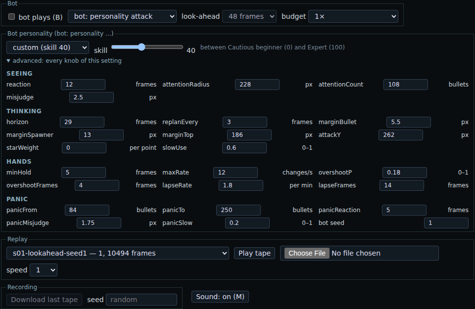

# H2 report — the human limits as bot settings, a skill slider and personality presets

Slice H2 of `docs/humanlike-plan.md`, 2026-10-04, branch `h2-humanlike`. ⚖ The user: the bot as it is now (the Expert)
is the MAX; lower settings make *"the sort of mistakes a human might make"*; *"I like all of those ideas. I want to
implement all of them. In addition to the skill slider, I would like to have some preset personalities, with
different settings for specific attributes. I would prefer not to have to do any manual recording."*

## Verdict

- **Every human limit of the plan is a setting** (23 knobs, `src/game/human.js` `KNOBS`). Their default is the
  Expert's behaviour exactly: with the default knobs the H1b Expert's tapes (`tapes/h1b/`, recorded from `main` at
  `2cc5176` before any H2 change: stages 1, 6, 10 attack and stage 1 no-attack, seed 1) re-record **byte for byte**,
  and so do the Ace's G4 tapes (`tapes/g4/` stages 1, 6, 10) and an H1 Expert tape (`tapes/h1/`):
  `node bin/check-bot-tapes.mjs tapes/h1b/*.json tapes/g4/s01-attack-seed1-b1x.json tapes/g4/s06-no-attack-seed1-b1x.json tapes/g4/s10-attack-seed1-b1x.json tapes/h1/s03-attack-seed1-expert.json`
  → *all 8 tapes the same*.
- **The bot's own random generator** (mulberry32, integer arithmetic only), seeded from the tape's seed and a bot seed;
  never the game's `rand()` (a test steps 900 frames and checks the game's generators untouched). The settings and the
  bot seed go into the tape, and the tape alone re-records the run: all 26 smoke tapes (`tapes/h2/`), full length,
  `node bin/check-bot-tapes.mjs tapes/h2/*.json` → *all 26 tapes the same*.
- **Eight presets** as data (one module), **a skill slider 0–100** (Cautious beginner → Expert; the Ace above it as a
  preset), and **the page**: a personality menu, the slider ("custom (skill N)"), and an advanced panel with every
  knob, editable. The page plays Node's moves input for input for Distracted, Panicky and skill 30
  (`npm run test:browser`).
- **Smoke** (stages 1 and 6, seed 1, every preset and skill 0/25/50/75/100; `results/h2-smoke.md`): the slider is
  monotonic on both stages (mean lives lost 4 → 4 → 1 → 0 → 0 on stage 1, 4 → 4 → 3 → 3 → 0 on stage 6); the
  Expert and the Ace lose nothing; every human preset loses lives; the beginner loses all its ships on both stages.
- **Sweep support:** `bin/h2-sweep.mjs` (presets × skills × stages × seeds × bot seeds, sharded, strict merge) and
  `.github/workflows/h2-sweep.yml`. **H3's calibration grid is the coordinator's to dispatch** ([the command](#the-h3-calibration-grid)).
- The engine is untouched: `npm run compare-native` (wrap) 137/137; `npm test`, `npm run test:browser` green.



## How the human layer works

A humanlike bot is the Expert (it plans on what it sees: `src/game/perception.js`) with three layers of limits
around its planner. The layer is **on only when a human knob differs from the Expert's**; otherwise the code path is
the H1b one, unchanged (that is why the old tapes re-record).

1. **What it sees.** Every frame it observes the screen, as the Expert does, and keeps the last pictures. At a
   *look* it plans on the picture of *reaction* frames ago, carried forward that many frames along what was seen
   then (`delayedModel`): every bullet and enemy keeps moving as it was seen moving; nothing fired, turned or shot
   down since is seen. **Decision: the ship's own state is current** (its position, speed, shots, invincibility): a
   player knows where they are pressing; it is the world they see late. Then *attention* drops the bullets farther
   than *attentionRadius*, and all but the nearest *attentionCount* (`attendModel`; enemies are always seen: they are
   big and drawn bright). Then *misjudgement*: the bullet clearance it keeps is off by a uniform error in ±*misjudge*
   px (a new error every 30 frames); when the clearance goes below 0 it believes the hit area (2 px around a bullet's
   trail) is smaller than it is, and can be hit by a bullet it "dodged" (`makeMargin` with a negative bullet
   clearance; `smallHit`).
2. **How it thinks.** The Expert's planner with its own settings: *horizon*, the margins (bullet / spawner / top),
   *attackY*, *starWeight*. It looks and replans every *replanEvery* frames; in between it plays its plan blind. At
   each look it remembers its slow button with probability *slowUse*; when it forgets, its searches try only the 9
   full-speed inputs.
3. **What its hands do** (`makeHands`). The planned input passes through: a change sooner than *minHold* frames after
   the last, or beyond *maxRate* changes in the last second, is not made (the last input stays); when the plan lets go
   of a direction, with probability *overshootP* it is held 1–*overshootFrames* frames too long; under panic it may
   mash the slow button for half a second. A **lapse** (*lapseRate* per minute, *lapseFrames* long on average, ½×–1½×)
   keeps pressing the last input and neither looks nor plans; after it, the bot starts over from a fresh look. The
   planner is not told what its hands did: it sees it in the next picture, as a player would.
4. **Panic.** A level 0–1 from the bullets on screen (0 below *panicFrom*, 1 at *panicTo*, linear between). At full
   panic its reaction is *panicReaction* frames slower, its misjudgement *panicMisjudge* px wider, and it has a
   *panicSlow* chance per half second to mash the slow button.

**Determinism.** The generator draws uniform numbers only (no `log`/`exp`/`cos`, whose last bit may differ between
JavaScript engines), from integer arithmetic; the model's arithmetic is +, −, ×, ÷ and sqrt, as in H1. Draws happen in
a fixed order each frame (lapse, then at a look: misjudgement, slow button; then the hands' overshoot and panic slow).
The budget stays a count, so the human layer adds no wall-clock dependence. The late picture and the attention filter
are not charged to the planning budget: a slow-reacting player does not think less.

**Units.** 1 frame = 16 ms (Noiz2sa's `INTERVAL_BASE`; 62.5 frames per second). Distances in px of the 320 × 480 field.

## Every knob

`KNOBS` in `src/game/human.js` holds each one's range, step, Expert value, skill direction and help text (the page's
tooltips). "Skill": ↑ = more is more skilled, ↓ = less is more skilled, habit = neither (not ordered by skill).

| Knob | Group | Meaning | Unit | Range | Default (Expert) | Skill |
|---|---|---|---|---|---:|---|
| `reaction` | seeing | plans on the screen as it was this many frames ago (carried forward) | frames | 0–40 | 0 | ↓ |
| `attentionRadius` | seeing | bullets farther from the ship are not seen (600 = whole screen) | px | 24–600 | 600 | ↑ |
| `attentionCount` | seeing | only the nearest this-many bullets are seen (1024 = all) | bullets | 4–1024 | 1024 | ↑ |
| `misjudge` | seeing | the bullet clearance is off by up to ± this (new error every 30 frames) | px | 0–8 | 0 | ↓ |
| `horizon` | thinking | how far ahead it plans (existed) | frames | 0–96 | 48 | ↑ |
| `replanEvery` | thinking | how often it looks again and replans | frames | 1–30 | 1 | ↓ |
| `marginBullet` | thinking | clearance kept from a bullet's drawn trail (H1b `margin.bullet`); < 0 = inside the hit area | px | −2–16 | 2 | habit |
| `marginSpawner` | thinking | clearance kept from an enemy / active bullet / unmoved dot (H1b) | px | 0–40 | 8 | habit |
| `marginTop` | thinking | the line it stays below (H1b) | px from top | 0–400 | 136 | habit |
| `attackY` | thinking | preferred height: where it waits under its target (H1b) | px from top | 16–440 | 160 | habit |
| `starWeight` | thinking | star greed: a star's points × this, against a kill's 4–16 | per point | 0–0.1 | 0 | habit |
| `slowUse` | thinking | chance per look that it remembers the slow button | 0–1 | 0–1 | 1 | ↑ |
| `minHold` | hands | a pressed input is held at least this long | frames | 1–16 | 1 | ↓ |
| `maxRate` | hands | input changes (direction or slow) per second at most (62.5 = no limit) | changes/s | 1–62.5 | 62.5 | ↑ |
| `overshootP` | hands | chance a direction let go of is held too long | 0–1 | 0–1 | 0 | ↓ |
| `overshootFrames` | hands | that overshoot: 1 to this many frames | frames | 0–12 | 0 | ↓ |
| `lapseRate` | hands | lapses of attention | per minute | 0–30 | 0 | ↓ |
| `lapseFrames` | hands | mean lapse length (½×–1½×) | frames | 0–90 | 0 | ↓ |
| `panicFrom` | panic | panic starts at this many bullets on screen | bullets | 0–600 | 150 | habit |
| `panicTo` | panic | panic is full at this many | bullets | 1–800 | 400 | habit |
| `panicReaction` | panic | extra reaction time at full panic | frames | 0–30 | 0 | ↓ |
| `panicMisjudge` | panic | extra misjudgement at full panic | px | 0–8 | 0 | ↓ |
| `panicSlow` | panic | chance per 30 frames, at full panic, to mash slow for 30 frames | 0–1 | 0–1 | 0 | ↓ |

Plus the **bot seed** (an integer ≥ 1, default 1), recorded in the tape with the knobs that differ from the Expert's
(`tape.bot.human`, `tape.bot.botSeed`, and `tape.bot.personality` as a label). `botOptionsFromTape(tape)` rebuilds the
bot from a tape.

## The presets

Values, the rationale, and the anchors they come from. **They are starting points chosen by judgement inside the
literature's ranges, not fitted**; H3 calibrates them against outcome targets.

| Knob | Ace | Expert | Steady veteran | Score chaser | Cautious beginner | Panicky | Tunnel vision | Distracted |
|---|---:|---:|---:|---:|---:|---:|---:|---:|
| reaction (frames) | — | 0 | 10 | 12 | 20 | 12 | 12 | 13 |
| attentionRadius (px) | — | 600 | 360 | 300 | 120 | 300 | **64** | 300 |
| attentionCount | — | 1024 | 160 | 120 | 24 | 120 | 40 | 120 |
| misjudge (px) | — | 0 | 1 | 2 | 4 | 1 | 1 | 1.5 |
| horizon (frames) | 48 | 48 | 48 | 32 | 16 | 32 | 32 | 32 |
| replanEvery (frames) | — | 1 | 2 | 2 | 4 | 2 | 2 | 3 |
| marginBullet (px) | — | 2 | 4 | **1** | **8** | 3 | 3 | 3 |
| marginSpawner (px) | — | 8 | 10 | 6 | 16 | 10 | 10 | 10 |
| marginTop (px) | — | 136 | 150 | 100 | 220 | 160 | 160 | 160 |
| attackY (px) | — | 160 | 180 | **120** | **330** | 220 | 200 | 200 |
| starWeight | — | 0 | 0 | **0.02** | 0 | 0 | 0 | 0 |
| slowUse | — | 1 | 1 | 0.8 | 0.3 | 0.9 | 0.9 | 0.8 |
| minHold (frames) | — | 1 | 3 | 3 | 7 | 3 | 3 | 3 |
| maxRate (changes/s) | — | 62.5 | 10 | 9 | 4 | 8 | 8 | 8 |
| overshootP | — | 0 | 0.05 | 0.12 | 0.3 | 0.1 | 0.1 | 0.1 |
| overshootFrames | — | 0 | 2 | 3 | 6 | 3 | 3 | 3 |
| lapseRate (per min) | — | 0 | 0.5 | 1 | 3 | 1 | 1 | **8** |
| lapseFrames | — | 0 | 12 | 14 | 24 | 14 | 14 | **30** |
| panicFrom / panicTo (bullets) | — | 150 / 400 | 150 / 400 | 120 / 350 | 40 / 150 | **50 / 180** | 120 / 350 | 120 / 350 |
| panicReaction (frames) | — | 0 | 3 | 4 | 8 | **14** | 4 | 4 |
| panicMisjudge (px) | — | 0 | 0.5 | 1 | 3 | **4** | 1 | 1 |
| panicSlow | — | 0 | 0 | 0.1 | 0.3 | **0.6** | 0.1 | 0.1 |

- **Ace** — the max bot (G4): plans on a copy of the seeded game; takes only its horizon. Not human.
- **Expert** — perfect perception and reflexes, no foresight: H1b, unchanged. The slider's 100.
- **Steady veteran** — reaction 10 frames (160 ms): practised action-game players respond faster than the
  ~200–250 ms of the general population [2, 3]. A generous margin (4 px), plans 48 frames ahead, replans every other
  frame, a 3-frame (48 ms) minimum hold and 10 changes/s (a trained player using several fingers), lapses rare
  (0.5/min) and short, mild panic.
- **Score chaser** — the star greed knob on (0.02: a 300-point star outweighs a small enemy's kill), attacks from
  high up (120 px) with a thin margin (1 px) and a lower top line (100 px): takes risks for points.
- **Cautious beginner** — reaction 20 frames (320 ms): simple reaction ~250 ms [1, 2] plus a choice among 8 directions
  (Hick–Hyman: reaction grows with the log of the choices [4, 5]); a short horizon (16), replans every 4 frames, an
  over-large margin (8 px from bullets, 16 from spawners), stays low (attacks from 330 px, a top line at 220), forgets
  the slow button (0.3), a 7-frame (112 ms) minimum hold [6] and 4 changes/s [7], overshoots often, tracks only its 24
  nearest bullets within 120 px [8, 9], 3 lapses a minute [10], panics early. The slider's 0.
- **Panicky** — moderate when calm; from 50 bullets on its reaction worsens by up to 14 frames, its misjudgement by up
  to 4 px, and it mashes the slow button (0.6): attention narrows and control degrades under arousal [11].
- **Tunnel vision** — an attention radius of 64 px and 40 bullets: the useful field of view shrinks under load [9, 12];
  it is surprised by bullets from the edges.
- **Distracted** — 8 lapses a minute of ~0.5 s (30 frames): its eyes leave the screen; lapses in vigilance tasks are
  counted as responses slower than 500 ms [10].

**Sources** (the anchors; quoted from memory, not re-checked online in this session — worth a look before citing them
further):

1. A. T. Welford (ed.), *Reaction Times*, Academic Press, 1980; R. J. Kosinski, *A Literature Review on Reaction Time*,
   Clemson University (2008, rev. 2013): simple visual reaction of young adults ~180–250 ms.
2. A. Jain, R. Bansal, A. Kumar, K. D. Singh, "A comparative study of visual and auditory reaction times on the basis of
   gender and physical activity levels of medical first year students", *Int. J. Applied and Basic Medical Research*
   5(2), 2015: visual reaction ~250 ms.
3. M. W. G. Dye, C. S. Green, D. Bavelier, "Increasing speed of processing with action video games", *Current
   Directions in Psychological Science* 18(6), 2009: action-game players respond faster at equal accuracy.
4. W. E. Hick, "On the rate of gain of information", *Quarterly J. Experimental Psychology* 4, 1952.
5. R. Hyman, "Stimulus information as a determinant of reaction time", *J. Experimental Psychology* 45, 1953.
6. K. S. Killourhy, R. A. Maxion, "Comparing anomaly-detection algorithms for keystroke dynamics", *DSN 2009*: key hold
   (dwell) times around 70–120 ms.
7. R. M. Ruff, S. B. Parker, "Gender- and age-specific changes in motor speed and eye-hand coordination in adults:
   normative values for the Finger Tapping and Grooved Pegboard Tests", *Perceptual and Motor Skills* 76, 1993: ~5
   taps per second per finger.
8. Z. W. Pylyshyn, R. W. Storm, "Tracking multiple independent targets: evidence for a parallel tracking mechanism",
   *Spatial Vision* 3(3), 1988: about 4–5 objects tracked at once.
9. K. K. Ball, B. L. Beard, D. L. Roenker, R. L. Miller, D. S. Griggs, "Age and visual search: expanding the useful
   field of view", *J. Optical Society of America A* 5(12), 1988.
10. D. F. Dinges, J. W. Powell, "Microcomputer analyses of performance on a portable, simple visual RT task during
    sustained operations", *Behavior Research Methods* 17(6), 1985 (the PVT; lapse = a response ≥ 500 ms);
    M. Basner, D. F. Dinges, "Maximizing sensitivity of the PVT to sleep loss", *Sleep* 34(5), 2011.
11. J. A. Easterbrook, "The effect of emotion on cue utilization and the organization of behavior", *Psychological
    Review* 66(3), 1959: arousal narrows the range of cues used.
12. L. J. Williams, "Tunnel vision or general interference? Cognitive load and attentional bias are both important",
    *American J. Psychology* 101, 1988.

The overshoot values, the panic thresholds and the misjudgement widths have no direct source: they are judgement,
for H3 to tune.

**Monotonic intent.** Every human preset is at most the Expert on every skill-ordered knob, and along the slider every
skill-ordered knob moves one way only (`test/bot.test.mjs` checks both). The habit knobs (margins, heights, star greed,
panic thresholds) are not ordered by skill: a beginner's large margin is caution, not skill.

## The skill slider

`skillKnobs(s)`, s in 0–100: every knob between Cautious beginner (0) and the Expert (100), each on its grid
(`snapKnob`): linearly, except `attentionRadius`, `attentionCount` and `maxRate`, which move geometrically (their
Expert values mean "no limit": a linear path would keep them near the limit until the very end). Below, the values at
five points (the full table: `results/h2-smoke.md` § The settings).

| Knob | 0 | 25 | 50 | 75 | 100 |
|---|---:|---:|---:|---:|---:|
| reaction | 20 | 15 | 10 | 5 | 0 |
| attentionRadius | 120 | 179 | 268 | 401 | 600 |
| attentionCount | 24 | 61 | 157 | 401 | 1024 |
| misjudge | 4 | 3 | 2 | 1 | 0 |
| horizon | 16 | 24 | 32 | 40 | 48 |
| replanEvery | 4 | 3 | 3 | 2 | 1 |
| minHold | 7 | 6 | 4 | 3 | 1 |
| maxRate | 4 | 8 | 16 | 31.5 | 62.5 |
| lapseRate / lapseFrames | 3 / 24 | 2.3 / 18 | 1.5 / 12 | 0.8 / 6 | 0 / 0 |
| marginBullet / attackY | 8 / 330 | 6.5 / 288 | 5 / 245 | 3.5 / 203 | 2 / 160 |

The Ace sits above 100, as a preset (the menu), not on the slider. In the page the slider sets every knob and the menu
then reads "custom (skill N)"; changing any knob in the advanced panel makes it "custom".

## The page

`play.html`: a new **Bot personality** box. The menu holds the 8 presets and "custom"; choosing one switches the bot
to "bot: personality attack" (or no-attack, if that was the variant). The skill slider; a one-line description; and
"advanced: every knob of this setting" — all 23 knobs grouped as above, plus the bot seed, each with its help text as a
tooltip, editable (on the knob's grid). The look-ahead menu is greyed for a personality: its horizon is a knob. The
old choices are unchanged: "bot: attack" / "bot: no-attack" is the Ace, "bot: expert …" the Expert, then the test
policies. All bots think in the worker (`web/bot-worker.js` now takes the makeBot options as they are), and the
start-up hold stays. The setting is remembered (localStorage). A recorded tape carries the bot record and the
personality's name, and replays in Node (`bin/check-bot-tapes.mjs`).

## Smoke results

`node bin/h2-sweep.mjs --presets all --skills 0,25,50,75,100 --stages 1,6 --seeds 1 --name h2-smoke --tapes` as 2
local shards, merged (`results/h2-smoke.md`, at `52f78a7`; 26 runs, 0.06 CPU-hours). Attack, seed 1, bot seed 1:

| Player | Stage 1 | Stage 6 | First hits (frames; 3750 = 1 min) | Mean score |
|---|---|---|---|---:|
| Ace | cleared, 0 lost | cleared, 0 lost | — | 2,946,770 |
| Expert (= skill 100) | cleared, 0 lost | cleared, 0 lost | — | 2,348,375 |
| Steady veteran | cleared, 1 lost | cleared, 2 lost | 7076 / 4566 | 1,617,430 |
| skill 75 | cleared, 0 lost | cleared, 3 lost | — / 4343 | 1,413,140 |
| skill 50 | cleared, 1 lost | cleared, 3 lost | 4555 / 4202 | 1,132,875 |
| Panicky | cleared, 2 lost | game over | 1627 / 388 | 732,290 |
| Distracted | game over | game over | 972 / 1754 | 629,735 |
| Tunnel vision | game over | game over (6 lost) | 246 / 1655 | 629,480 |
| Score chaser | game over | game over | 766 / 1795 | 477,895 |
| skill 25 | cleared, 4 lost | game over | 320 / 1242 | 477,265 |
| Cautious beginner (= skill 0) | game over | game over | 6250 / 646 | 372,685 |

(A game over = 4 lives lost on stage 1–10 unless an extend gave a 5th or 6th.) What it says, from one seed only:

- The slider is monotonic here, and the beginner loses every ship. But the plan's first outcome target ("skill 0
  rarely survives stage 1's first minute") is **not met**: on stage 1 its first hit came at 100 s; its large margin
  and low position keep it out of trouble early. The middle of the slider is already quite weak (skill 25 loses 4
  ships on stage 1). Those are H3's to tune.
- The presets differ in kind as intended: Panicky does well on calm stage 1 and collapses on stage 6 (first hit at
  6 s); Tunnel vision is hit in the first 4 s of stage 1; Distracted spends ~460 frames per run in lapses; the Score
  chaser pays for its greed.
- Cost: a humanlike run is mostly *cheaper* than the Expert's (1–7 CPU s for a stage; the Steady veteran 7–18, the
  Expert 8–20, the Ace 35): it plans less often, over shorter horizons, and dies sooner. (The page's frame rate with a
  humanlike bot was not measured separately; its worker does less work per frame than the Expert's, which the browser
  test measures at full speed.)

## The H3 calibration grid

The workflow must be on the default branch to be dispatched (GitHub's rule for `workflow_dispatch`), so this runs after
the merge of `h2-humanlike`:

```
gh workflow run h2-sweep.yml --ref main -f name=h3-grid -f presets=all \
  -f skills=0,10,20,30,40,50,60,70,80,90,100 -f variants=attack -f stages=1,2,3,4,5,6,7,8,9,10 \
  -f seeds=1,2,3 -f bot_seeds=1,2 -f shards=16
```

1,050 runs (16 humanlike players × 10 stages × 3 seeds × 2 bot seeds, and the Ace, the Expert and skill 100 once per
seed: they never draw from their generator). By the smoke's costs about 3 CPU-hours: ~10 minutes on 16 four-core
runners. The merge job fails, naming them, if a shard is missing; the artifact `h2-sweep-h3-grid` holds
`results/h3-grid.md` (lives lost per stage per player, the slider's monotonicity per stage, the human layer's counts,
the settings) and `.json`. Add `-f extra=--tapes` to keep every run's tape (they replay in the page). Locally, the same
with `node bin/h2-sweep.mjs --presets all --skills 0,10,…,100 --stages 1,…,10 --seeds 1,2,3 --bot-seeds 1,2 --shard i/16`.

## Tests added

- `test/bot.test.mjs` § 7: every preset and skill 0 / 50 gives the same tape twice, the tape replays, and the tape's
  own record re-records it; another bot seed gives other moves; a humanlike bot never touches the game's generators;
  the generator is pinned; the default knobs re-record the H1b Expert and the G4 Ace (3,000 frames of each); human knobs
  need perception "observed"; presets on their grids; the slider's ends and its monotonicity; the hands (minimum hold,
  rate cap, overshoot); the late picture puts straight bullets where they are now; attention.
- `test/browser.test.mjs` § 2d: Distracted, Panicky and skill 30 from the menu and the slider; the menu reads
  "custom (skill 30)"; the tape records the setting; Node's bot built from the tape's record plays the page's 900
  frames input for input; the advanced panel shows every knob and makes the setting custom.
- `bin/check-bot-tapes.mjs`: re-record any bot tape from its record (replaces nothing; `bin/check-g4-tapes.mjs` stays).

## Open questions for the user

1. **Names and characters.** The 8 presets are the plan's first proposal. Rename any, add any (e.g. a "Bullet-hell
   veteran" faster than the Steady veteran, or a "Button masher")?
2. **The reaction-time model.** The bot sees the world late but its own ship now, and carries what it saw forward
   along its seen motion (so a steady stream of bullets is dodged well even late; only the new and the changed are
   missed). The alternative — the stale picture as it was, not carried forward — is much harsher. Keep this one?
3. **The slider's shape.** Linear between the beginner and the Expert (geometric for three knobs). The smoke suggests
   it is weak in the middle (skill 25 ≈ the beginner, skill 75 ≈ the veteran). H3 can bend it (e.g. a curve per knob)
   to hit outcome targets. Which targets? The plan's first proposal: skill 0 rarely survives stage 1's first minute;
   skill 50 clears the early stages with losses; skill 100 (the Expert) clears most stages.
4. **Does the slider need a top above the Expert** (101 = the Ace), or is the Ace in the menu enough?
5. **Bot seed in the page**: fixed at 1 (editable under advanced) so a seed replays the same game; or random per game
   (like the game seed when it is left blank)?
